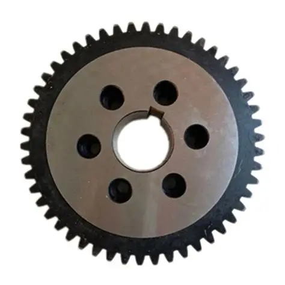

# ⚙️ Spur Gear Dimensional Analysis using Computer Vision

> AI-powered system for automated spur gear tooth counting and dimensional measurement using computer vision techniques.

---

## 📋 Table of Contents

- [Overview](#-overview)
- [Features](#-features)
- [Demo](#-demo)
- [Technology Stack](#-technology-stack)
- [Installation](#-installation)
- [Usage](#-usage)
- [Project Structure](#-project-structure)
- [Algorithm Details](#-algorithm-details)
- [Results](#-results)
- [Contributing](#-contributing)
- [Author](#-author)
- [License](#-license)

---

## 🎯 Overview

This project implements an advanced computer vision system for automated analysis of spur gears. The system can accurately detect and count gear teeth, measure dimensional parameters, and provide comprehensive analysis reports. Developed as a B.Tech project, it demonstrates practical applications of CV techniques in industrial quality control.

### Key Capabilities
- **Automated Tooth Counting**: Accurate detection using multiple algorithms
- **Dimensional Measurements**: Addendum, dedendum, pitch radius, module calculations
- **Real-time Processing**: 3-8 second analysis time
- **Calibration Support**: Convert pixel measurements to millimeters
- **Web Interface**: Professional Gradio-based UI with responsive design

---

## ✨ Features

### 🔍 Detection & Analysis
- **Multi-Algorithm Approach**: Peak detection + FFT consensus for reliability
- **Adaptive Processing**: Automatic noise level detection and filtering
- **Quality Metrics**: Confidence scoring and method validation
- **Edge Cases Handling**: Works with various gear conditions and image qualities

### 📊 Measurements
- **Geometric Parameters**: 
  - Addendum radius (outer)
  - Dedendum radius (root)
  - Pitch radius (effective)
  - Module and circular pitch
  - Tooth height and outer diameter
- **Calibration Support**: Physical unit conversion (mm)
- **Center Detection**: Robust geometric center calculation

### 🎨 User Interface
- **Modern Web UI**: Responsive design with light/dark theme support
- **Interactive Dashboard**: Real-time results with visual overlays
- **Image Processing**: Drag-and-drop upload with preview
- **Export Options**: JSON results, CSV profiles, annotated images

---

## 🚀 Demo

### Live Application
**🌐 Try it online:** [Spur Gear Analyzer](https://huggingface.co/spaces/darsahran/spur-gear-analyzer)

### Sample Results
| Input | Output | Measurements |
|-------|--------|-------------|
|  |  | **29 teeth detected** Quality: 94% Processing: 4.2s |

---

## 🛠 Technology Stack

### Core Libraries
- **Computer Vision**: OpenCV 4.8.1
- **Signal Processing**: SciPy (peak detection, FFT)
- **Numerical Computing**: NumPy
- **Visualization**: Matplotlib
- **Web Framework**: Gradio 4.44.1

### Algorithms Used
- **Image Preprocessing**: CLAHE, Gaussian blur, morphological operations
- **Segmentation**: Adaptive thresholding, contour detection
- **Feature Extraction**: Radial profile sampling, polar transformations
- **Tooth Detection**: Savitzky-Golay filtering, peak detection, FFT analysis
- **Measurement**: Geometric calculations, calibration transforms

---

## 📦 Installation

### Prerequisites
- Python 3.8 or higher
- Virtual environment (recommended)

### Quick Start

